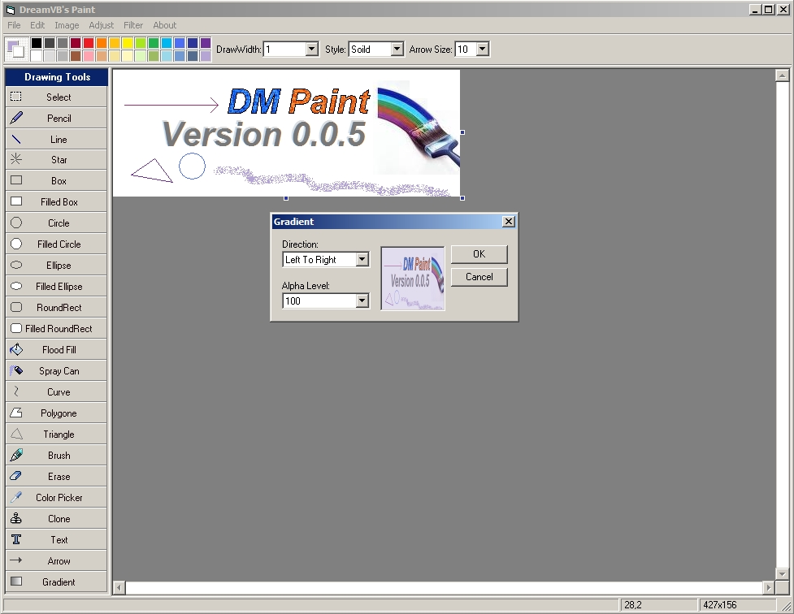



## DM Paint Ver 0\.0\.5

### Description

Hi DMPaint is a small project I been working on the last few days that allows you to draw pictures, the program comes with many standred drawing tools UPDATE 14/5/09 Fix bug in selection tool, Added new mirror effects for left and right, Added gradient effect, Added triangle tool, Added arrow tool, Added snow fliter, Add some new brushs, Added support to save to png, gif and JPEG, Added crop image, Updated grident tool you can now see the gradient as you draw and much more hope you like this update.
 
### More Info
 

             |
---                |---
**Submitted On**   |2009-05-13 08:22:56
**By**             |[dreamvb](https://github.com/Planet-Source-Code/PSCIndex/blob/master/ByAuthor/dreamvb.md)
**Level**          |Beginner
**User Rating**    |5.0 (105 globes from 21 users)
**Compatibility**  |VB 6\.0
**Category**       |[Graphics](https://github.com/Planet-Source-Code/PSCIndex/blob/master/ByCategory/graphics__1-46.md)
**World**          |[Visual Basic](https://github.com/Planet-Source-Code/PSCIndex/blob/master/ByWorld/visual-basic.md)
**Archive File**   |[DM\_Paint\_V2152285142009\.zip](https://github.com/Planet-Source-Code/dreamvb-dm-paint-ver-0-0-5__1-71962/archive/master.zip)

